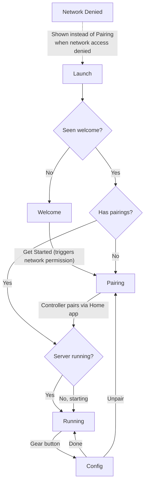

# UX Flow Redesign

## Overview

Redesign Pylo's user flow to add onboarding, separate status from configuration, consolidate camera selection, and add an iOS Settings bundle. Builds on the `doorbell` branch (PR #48) which already separates RunningView from ConfigView.

## Screen Flow

## Screens

### 1. Welcome (shown once)

- Displayed on first launch only (persisted flag in UserDefaults).
- Brief overview: Pylo turns your device into a HomeKit bridge with native accessories.
- Key callout: "Pylo must remain in the foreground with the screen on to work."
- "Get Started" button triggers the local network permission prompt, then navigates to Pairing.
- Not shown again after dismissal, even if the user unpairs later.

### 2. Pairing

- QR code + setup code (existing behavior).
- Instruction text: "Scan with the Home app or enter the code manually" (existing).
- Subtle reminder at the bottom: "Keep Pylo in the foreground while in use."
- Server is auto-started and running during this screen.

### 3. Running

- Minimal black screen with pixel-shift burn-in prevention (from doorbell branch).
- "Running" status indicator.
- Doorbell/button tile when button accessory is enabled (from doorbell branch).
- Gear icon in top-right opens Config as a full-screen cover.

### 4. Config (full-screen cover)

Grouped scrollable view with section headers. "Settings" nav title. "Done" button in toolbar dismisses back to Running.

#### General section (top)

| Setting | Control | Notes |
|---------|---------|-------|
| Camera | Picker | Single global selection used by all camera-dependent accessories |
| Keep Display On | Toggle | |
| Screen Saver | Toggle + delay picker | Delay picker shown when enabled |
| Unpair | Destructive button | Confirmation dialog before executing. Not in Settings bundle. |

#### Accessories section (below)

Accessory cards as today with these changes:

- **Camera**: Removes camera picker (uses global). Keeps quality, microphone, status.
- **Light Sensor**: Removes camera picker. Shows read-only "Using: [camera name]" when relevant.
- **Occupancy Sensor**: Removes camera picker. Keeps cooldown, status. Shows read-only camera note.
- **All other cards**: Unchanged (button, flashlight, motion sensor, contact sensor, siren).

Camera-dependent accessory cards that would have shown a picker instead show a read-only line indicating which camera is in use.

### 5. iOS Settings Bundle

Mirrors the General section (excluding Unpair):

- Camera selection
- Keep Display On
- Screen Saver enabled + delay

Changes made in the iOS Settings app are picked up when the app returns to foreground via `scenePhase` observation. Unpair is excluded because it is a destructive action requiring the in-app confirmation dialog.

## Behavioral Details

### Camera consolidation

The current codebase has two independent camera selections: `selectedStreamCamera` (for the camera/streaming accessory) and `sensorCamera` (for light sensor/occupancy when camera streaming is off). These are collapsed into a single global camera picker. All camera-dependent accessories use the same camera. The `sensorCamera` property is removed.

### Network denied

The existing `networkDeniedBody` is unchanged. It is shown in place of Pairing/Running when local network access is denied. If the user denies network permission during "Get Started" on the Welcome screen, they proceed to Pairing and see the network denied state there (the welcome flag is still set -- they don't see the welcome screen again).

### Camera/microphone permissions

Permission flows are unchanged from current behavior. Each accessory card requests the relevant permission (camera or microphone) when its toggle is enabled. If denied, the card shows a "Permission denied" blocked state with an alert offering to open Settings. The welcome screen does not request camera/microphone permissions.

### Restart banner

The existing `needsRestart` mechanism is unchanged. When accessory config diverges from the running server config, the "Restart to Apply" banner appears at the bottom of the Config view (as it does today in the doorbell branch). It does not appear on RunningView.

### Settings bundle and restart

Changes made in the iOS Settings app are read on foreground return. If a Settings bundle change affects the running server config (e.g., camera selection changed), it triggers the same `needsRestart` comparison, and the banner appears next time the user opens Config. Settings bundle values are limited to non-dynamic options -- camera selection may need to be omitted from the Settings bundle if populating it dynamically proves impractical (Settings bundles use static plists). In that case, the Settings bundle contains only Keep Display On and Screen Saver settings.

### Backgrounding

Unchanged from current behavior. The app does not show a warning on return from background. The RunningView's screen-dimming/pixel-shift handles the "always on" use case.

### Unpair

Unpair stops the server, clears all pairings, and returns to the Pairing screen where the server restarts with a fresh setup code. This matches current behavior.

## Key Decisions

- **Welcome shown once ever**, not on every unpaired launch. Prevents annoyance if user unpairs/re-pairs.
- **"Get Started" triggers network permission** proactively rather than waiting for implicit server start failure.
- **Single global camera picker** in General settings, not per-accessory. Reduces duplication and confusion. All camera-dependent accessories share one camera.
- **Settings in config view** rather than a separate view. Keeps navigation simple (one gear button on RunningView).
- **Settings bundle mirrors in-app settings** where feasible (static options). Destructive actions (unpair) remain in-app only. Dynamic options like camera selection may be omitted if Settings bundle limitations prevent it.
